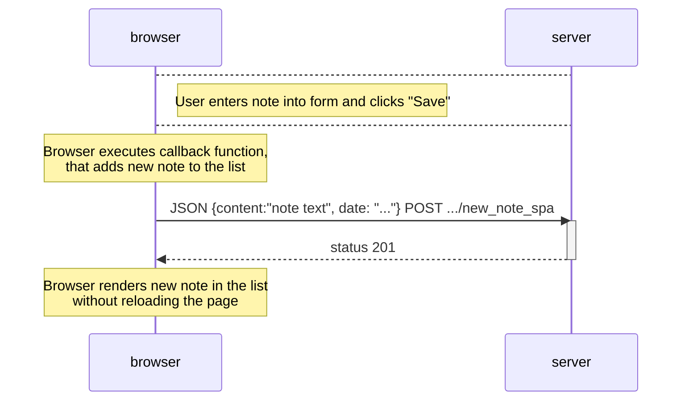

# New Note Is Single Page App

```mermaid
sequenceDiagram
    participant browser
    participant server

    browser-->server: 
    Note right of browser: User enters note into form and clicks "Save"
    browser-->server: 

    Note over browser: Browser executes callback function, <br/>that adds new note to the list

    browser->>server: JSON {content:"note text", date: "..."} POST .../new_note_spa 
    activate server
    server-->>browser: status 201
    deactivate server

    Note over browser: Browser renders new note in the list<br/> without reloading the page
```
